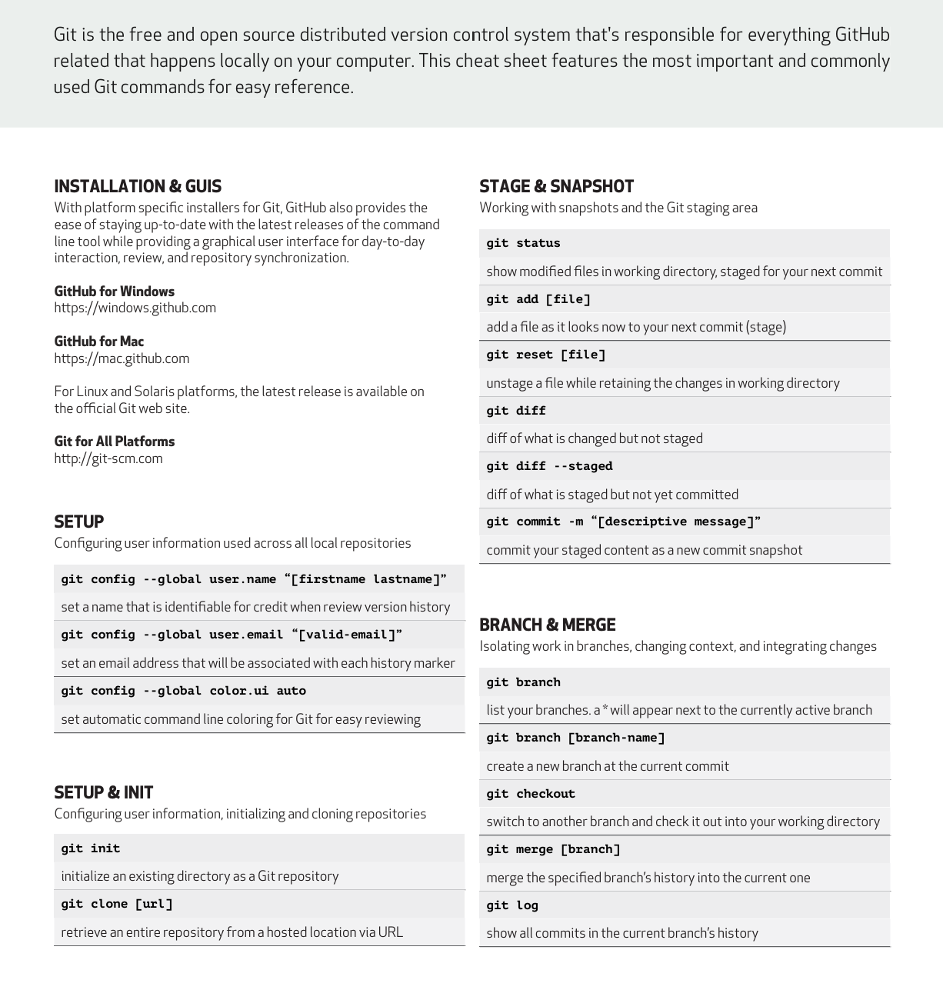

# learning-git-github
Author - Rigu
<br>

A complete beginner-friendly repository for learning Git, GitHub, and Version Control.

```text
Git-Cheat-Sheet/
│
├── 📄 Git_Cheat_Sheet.pdf
├── 📄 README.md
│
├── 📂 Topics Covered
│   ├── Introduction
│   ├── Git Introduction
│   ├── GitHub Introduction
│   ├── Setting Up GitHub
│   ├── Setting Up Git
│   ├── Configuring Git
│   ├── Working with VS Code
│   ├── Clone and Status
│   ├── Add and Commit
│   ├── Push Command
│   ├── Init Command
│   ├── Git Workflow
│   ├── Git Branches
│   ├── Branch Commands
│   ├── Merging Code
│   ├── Pull Request
│   ├── Pull Command
│   ├── Resolving Merge Conflicts
│   ├── Undoing Changes
│   └── Fork
│
├── 📂 Core Git Concepts
│   ├── Setup & Configuration
│   ├── Repository Initialization
│   ├── Staging & Snapshots
│   ├── Branching & Merging
│   ├── Share & Update
│   ├── Tracking Path Changes
│   ├── Rewrite History
│   ├── Temporary Commits (Stash)
│   ├── Inspect & Compare
│   └── Ignoring Files (.gitignore)
│
└── 🚀 Quick Reference for Daily Git Commands


# Recommended Structure
learning-git-github/
│
├── README.md
├── Git_Cheat_Sheet.pdf
├── index.html
├──page1.png
├──page2.png
│ 
├── notes/
│   ├── 01-git-introduction.md
│   ├── 02-github-introduction.md
│   ├── 03-setup-git.md
│   ├── 04-configuring-git.md
│   ├── 05-working-with-vscode.md
│   └── 06-git-workflow.md
│
├── commands/
│   ├── clone-status.md
│   ├── add-commit.md
│   ├── push-pull.md
│   ├── init-command.md
│   ├── branches.md
│   ├── merge.md
│   ├── pull-request.md
│   ├── merge-conflicts.md
│   ├── undoing-changes.md
│   └── fork.md
│
├── images/
│   ├── git-workflow.png
│   ├── branch-diagram.png
│   └── github-interface.png
│
└── examples/
    ├── basic-workflow.txt
    ├── branching-example.txt
    └── collaboration-example.txt


## Git Cheat Sheet




